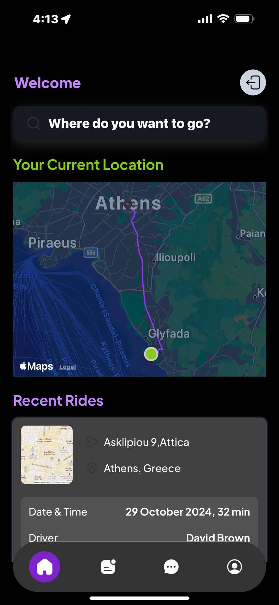
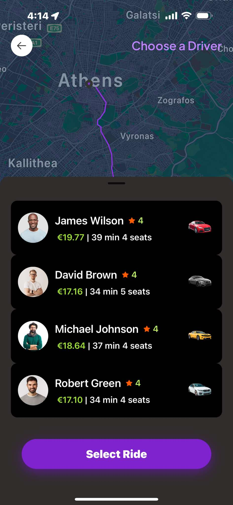
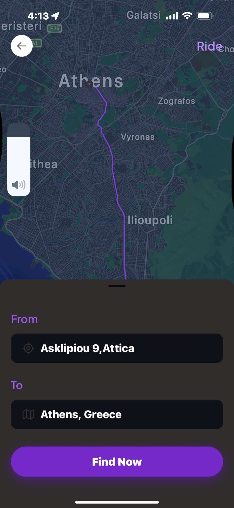

# Tarifas

**Tarifas** is an Uber-like mobile application designed to provide a seamless ride-hailing experience. Built with React Native, Expo, and a combination of modern technologies, Tarifas aims to connect drivers and riders efficiently while offering real-time chat and payment processing capabilities.

## Table of Contents

- [Features](#features)
- [Technologies Used](#technologies-used)
- [Installation](#installation)
- [Usage](#usage)
- [Contributing](#contributing)
- [License](#license)

## Features

- **Real-time Chat**: Integrated chat functionality powered by Firebase, allowing riders and drivers to communicate effortlessly.
- **Google Maps Integration**: Use Google Maps for location tracking, route optimization, and directions.
- **Payment Processing**: Secure payments using Stripe for a smooth transaction experience.
- **User Authentication**: Sign in and manage user profiles with Clerk.
- **Intuitive UI**: Designed using Native Wind for a responsive and user-friendly interface.
- **Ride Management**: Manage rides, view ride history, and rate drivers.

## Technologies Used

- **React Native**: A framework for building native applications using React.
- **Expo**: A framework and platform for universal React applications, making development easier.
- **Native Wind**: A utility-first CSS framework for styling React Native applications.
- **Google Maps API**: Used for maps and location services.
- **Google Directions API**: Provides directions between locations.
- **Stripe**: For secure payment processing.
- **Gifted Chat**: A chat UI component for React Native applications, integrated with Firebase.
- **Firebase**: For real-time database capabilities and authentication.

## Installation

To get started with the project, clone the repository and install the dependencies:

        
      git clone https://github.com/Konstantilieris/Tarifas.git
      cd Tarifas
      npm install
## Environment Variables
  Make sure to set up the necessary environment variables for Firebase and Stripe. Create a .env file in the root directory and add the following:
   
   
           FIREBASE_API_KEY=your_firebase_api_key
           STRIPE_PUBLIC_KEY=your_stripe_public_key
## Usage
  After setting up the environment variables, you can start the development server:

    
       
        npm start
      This will launch the Expo development environment. You can scan the QR code with your Expo Go app to view the project on your mobile device.

Contributing
Contributions are welcome! Please fork the repository and create a pull request with your changes. Make sure to update tests as appropriate.

## Screenshots

Here are some screenshots of the Tarifas app in action:

  
  
  

Enjoy using Tarifas! If you have any questions or suggestions, feel free to reach out.

